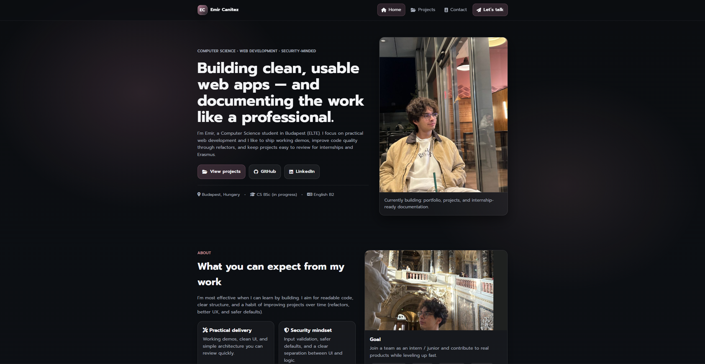
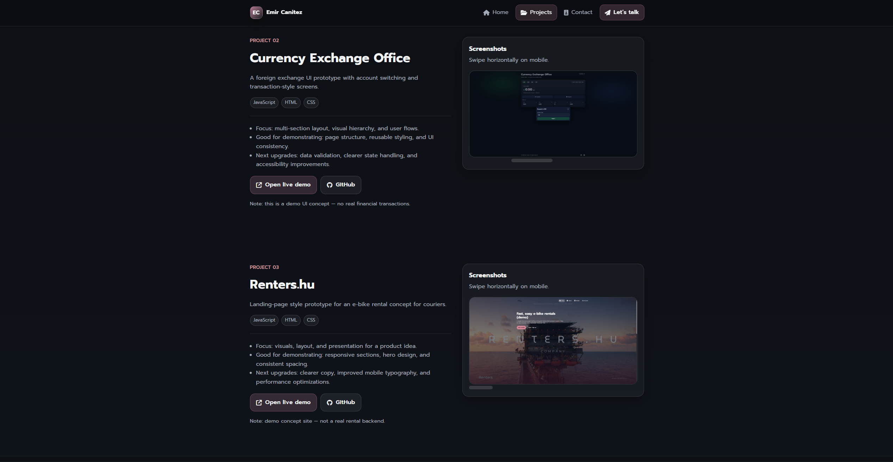
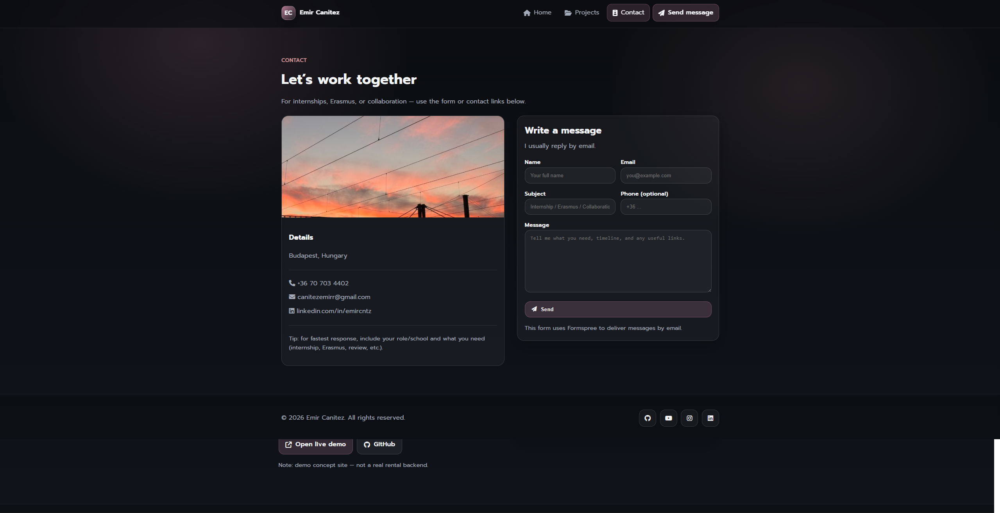

# Emir Cantez — Portfolio (GitHub Pages)

A **mobile-first**, portfolio-ready personal website showcasing my projects, skills, and contact details.  
Built with **HTML, CSS, and Vanilla JavaScript** and deployed via **GitHub Pages**.

**Highlights:** Responsive layout • Clean UI spacing/typography • Project-focused structure • Fast load (static) • Recruiter-friendly

> **Scope (intentional):** This is a **static** site (no backend).  
> The contact form is configured for a third-party endpoint (e.g., Formspree) or simple mailto flow depending on configuration.

---

## Live
- https://cntzemir.github.io/

---

## What a Reviewer Can Verify Quickly
- **Opens instantly** (live link) and works without setup
- **Responsive UI:** desktop + mobile layouts (no overflow / broken grids)
- **Clear navigation:** Home → Projects → Contact
- **Project cards:** short descriptions + links to repo/demo
- **Code hygiene:** structured assets folder, readable naming, minimal duplication

---

## Screenshots

### Quick Preview
| Home | Projects | Contact |
|---|---|---|
|  |  |  |

---

## Featured Projects
These are included on the Projects page (with repo/demo links):

- **E-Bike Rental Demo** — static front-end flow (login → dashboard → rent request)  
  Repo: https://github.com/cntzemir/e-bike-rental-demo  
  Live: https://cntzemir.github.io/e-bike-rental-demo/

- **JavaScript Exchange** — currency exchange practice app (UI + validation + predictable state)  
  Repo: https://github.com/cntzemir/javascript-exchange  
  Live: https://cntzemir.github.io/javascript-exchange/

- **JavaScript Calculator** — clean calculator UI and logic  
  Repo: https://github.com/cntzemir/javascript-calculator

---

## Features

### UI / UX
- Responsive layout (grid/cards) with consistent spacing
- Clean typography and readable hierarchy (headings, sections, cards)
- Accessible interactions (focus states, keyboard-friendly nav)

### Content Structure
- Clear introduction and focus areas (web development / security mindset / algorithms)
- Project-first presentation (what it is + why it matters + links)
- Simple, direct contact section (email + socials)

### Performance / Delivery
- Static site (fast load, no build step)
- Optimized assets folder structure for maintainability

---

## Tech Stack
- **HTML5**
- **CSS** (variables, responsive layout)
- **JavaScript** (small UI interactions)

---

## Run Locally
**Option A — Open directly**
1. Download / clone the repository
2. Open `index.html` in your browser

**Option B — Local server (recommended)**
```bash
python -m http.server 5500
# open http://localhost:5500

.
├─ index.html
├─ projects.html
├─ contact.html
├─ assets/
│  ├─ css/
│  │  └─ main.css
│  ├─ js/
│  │  └─ main.js
│  └─ img/
│     ├─ hero-portrait.jpg
│     ├─ about-photo.jpg
│     ├─ contact-photo.jpg
│     └─ gallery-*.jpg
└─ docs/
   └─ screenshots/```
